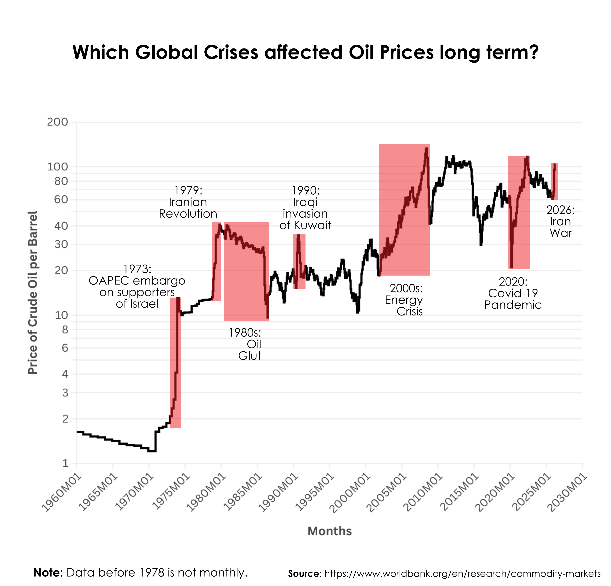
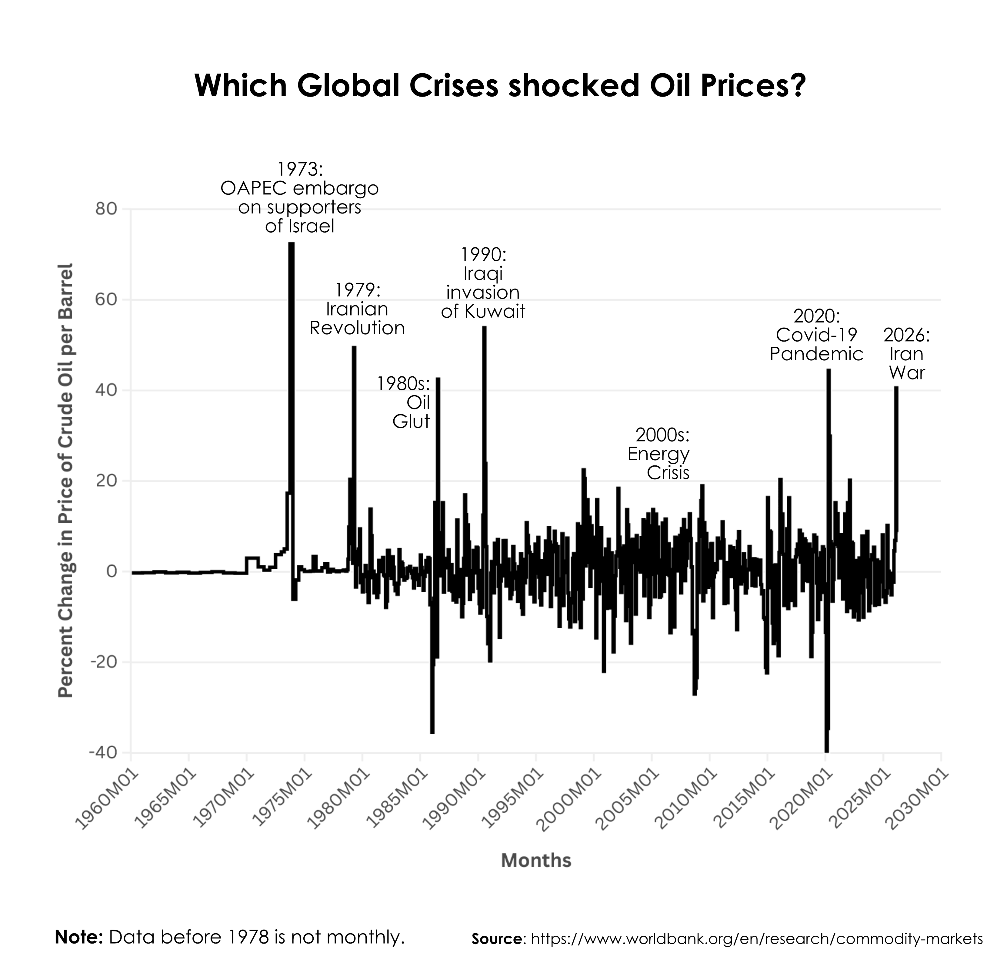
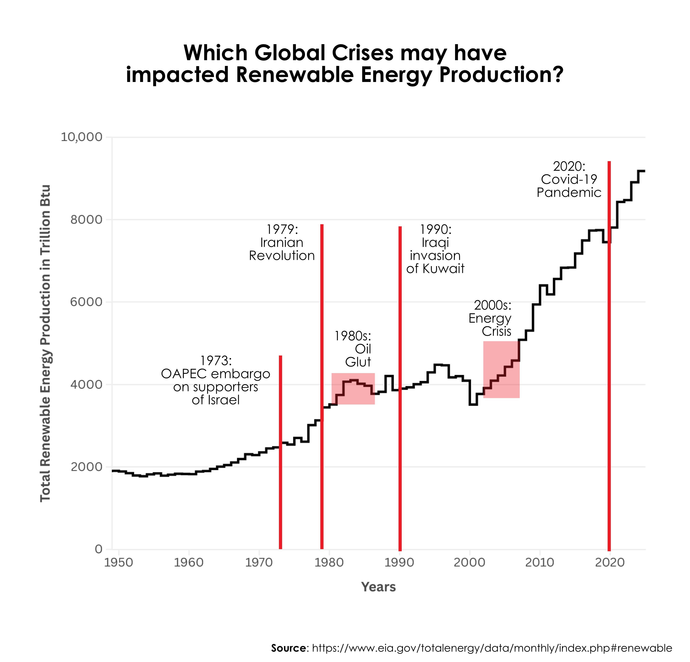

# Crude-and-Crisis

This project explores trends in crisis and crude oil price

## Visualizations

### Current Oil Price

---

### Oil Prices Spikes

---

### Renewable Energy

---

## Overview

The charts included in this repository provide insights into:

- Current oil production levels and trends
- Historical and recent oil price fluctuations
- Growth and adoption of renewable energy sources

## Authors
- Francisco Trujillo
- Elijah Shaw
